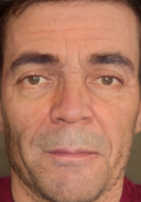
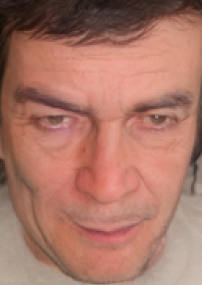

# Human Attention Assessment Using A Machine Learning Approach with GAN-based Data Augmentation Technique Trained Using a Custom Dataset

## Introduction

Many human-computer or human-robot interactions require the capability of the system of understanting whether the user is paying attention or not. However, to train such systems, large amounts of data are needed, but they are currently unavailable. In this paper, we first address the issue of data scarcity by creating a large dataset -- with about 120k images -- for the attention detection task. Then, we develop a strong baseline system which is able to correctly perform the task, achieving competitive results on the proposed dataset. Further, we extend our system by: i) adding an auxiliary face detection module, and ii) introducing a novel GAN-based data augmentation technique.
Finally, we design a web application to enable real-time testing of the developed model.

For further details, see the [paper](https://www.lidsen.com/journals/neurobiology/neurobiology-06-04-139).

## Table of contents

- [Attention Detection System](#attention-detection-system)
  - [Introduction](#introduction)
  - [Table of contents](#table-of-contents)
    - [Dataset](#dataset)
      - [**1) Standard Dataset**](#1-standard-dataset)
      - [**2) Face Detection Dataset**](#2-face-detection-dataset)
      - [**3) GAN augmented dataset**](#3-gan-augmented-dataset)
  - [How to download the dataset](#how-to-download-the-dataset)
    - [Code](#code)
    - [Demo](#demo)
    - [WebApp](#webapp)
    - [Contributors](#contributors)

* [Code](#Code)

* [Demo](#Demo)

* [WebApp](#App)

### Dataset

We design our dataset in the following way:
- we use five classes: Center, Left, Right, Up and Down.  The Center class is the only positive label for our task, indicating that the interlocutor is heedful;
- we recorded 270 videos from 18 different users, each video lasting &sim;20 seconds. In particular, each user was asked to record 15 videos, changing its location and/or its outfit -- including glasses -- every 5 of them, to let the dataset be as general as possible.

Together with *standard* dataset we provide also the pre-processed images used for our 2 main experiments: *face detection* and *GAN*.

#### **1) Standard Dataset**

We show an example of each sample class present in the our standard dataset

<span style="font-variant:small-caps;">Center</span> |  <span style="font-variant:small-caps;">Left</span> |<span style="font-variant:small-caps;">Right</span> | <span style="font-variant:small-caps;">Up</span> | <span style="font-variant:small-caps;">Down</span> 
:-------------------------:|:-------------------------:|:-------------------------:|:-------------------------:|:-------------------------:|
  |   | |  |   

#### **2) Face Detection Dataset**

We show an example of each sample class present in the face detection dataset

<span style="font-variant:small-caps;">Center</span> |  <span style="font-variant:small-caps;">Left</span> |<span style="font-variant:small-caps;">Right</span> | <span style="font-variant:small-caps;">Up</span> | <span style="font-variant:small-caps;">Down</span> 
:-------------------------:|:-------------------------:|:-------------------------:|:-------------------------:|:-------------------------:|
  |   | |  |   

#### **3) GAN augmented dataset**

We show an example of each sample class present in the GAN-based augmented dataset


<span style="font-variant:small-caps;">Center</span> |  <span style="   font-variant:small-caps;">Left</span> |<span style="font-variant:small-caps;">Right</span> | <span style="font-variant:small-caps;">Up</span> | <span style="font-variant:small-caps;">Down</span> 
:-------------------------:|:-------------------------:|:-------------------------:|:-------------------------:|:-------------------------:|
  |   | |  |   


In particular, for all three cases we provide datasets with the standard split in train, validation and test sets. 

## How to download the dataset

If you wants to download only a dataset and not do the training, you can execute the following instructions

```
$ cd ./datasets

$ python download_dataset.py --set_type name_type
```

where name_type could be: **standard**, **face_detection** or **GAN**.
The three datasets will be downloaded in the respective directory (created by the script).

Otherwise you have to go to [Notebook](#Code) where there are notebooks for our three cases to train your model.

For further details, see the [paper](./paper/tedeschi-pepe-attention-detection.pdf).

### Code 

We have created three notebooks for the three different experiments:

* [Standard](./notebooks/Attention_Detection_Baseline_Training.ipynb)
* [Face Detection](./notebooks/Attention_Detection_Face_Detection_Training.ipynb)
* [GAN](./notebooks/Attention_Detection_GAN_Training.ipynb)

*Face Detection model* obtains an average improvement of 12.85 accuracy points over  *Standard model* . Moreover, we observe an extreme statistical significance in our results, showing how this technique is fundamental for our task. With the addition of the *GANs* our system provide further improvements over a yet very strong system. Once again, we found statistical significance in our results. 

For further details, see the [paper](./paper/tedeschi-pepe-attention-detection.pdf).

### Demo

https://user-images.githubusercontent.com/47241515/120891166-56e74580-c607-11eb-93dd-446f8bd8138e.mp4

Note: we lowered the fps rate to let the attention detection system have the needed time to produce its prediction.


### WebApp
<a href = "https://pepes97.github.io/HumanAttentionAssessmentML/" onclick="return ! window.open(this.href);">
 
</a>

### Contributors

* [Simone Tedeschi](https://github.com/sted97/)
* [Sveva Pepe](https://github.com/pepes97/)
